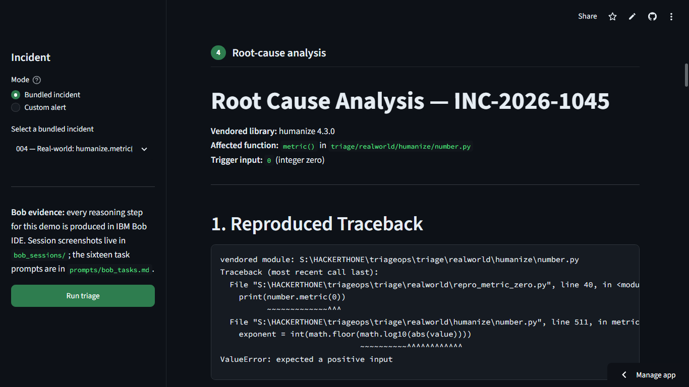
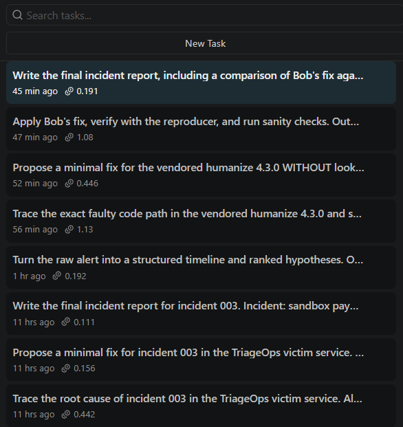
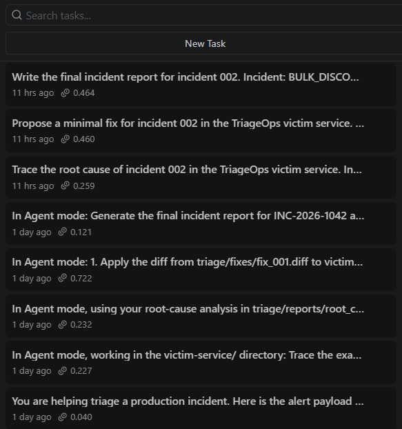
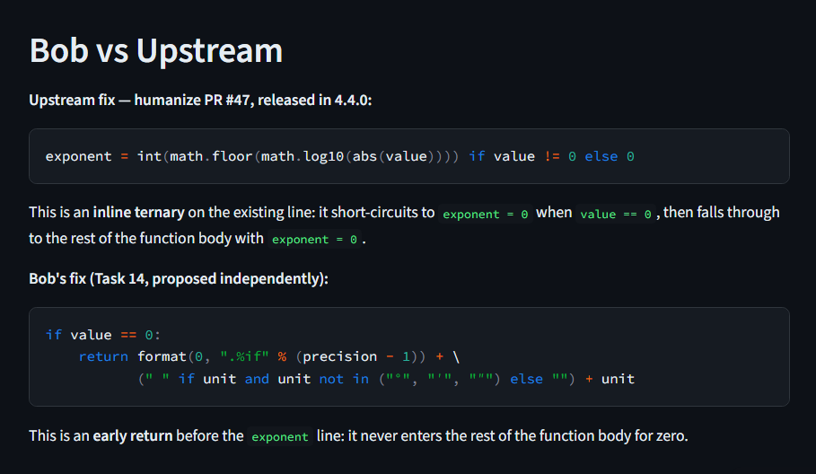

# TriageOps — incident triage assistant

[](https://triageops.streamlit.app/)
[](LICENSE)
[](https://lablab.ai/ai-hackathons/ibm-bob-2-hackathon)

Built for the **IBM Bob 2.0 hackathon** (lablab.ai, 48-hour build, Sept 25–27 2026).
Theme: *improve a developer workflow* — here, **debugging / incident response**.

**Live demo:** https://triageops.streamlit.app/

## The problem

When an alert fires, an on-call engineer burns tens of minutes on mechanical
triage: reading the alert, grepping logs, reconstructing a timeline, tracing
the fault through code, guessing a fix, and proving it works. For three of the
most common bug classes — **crashes** (stack traces), **silent logic bugs**
(no crash, wrong numbers), and **config mistakes** (only visible after a
deploy) — that loop is slow, error-prone, and miserable at 2am.

## What TriageOps does

Feed it an incident alert + service logs. It:

1. Parses the alert (service, endpoint, error signature, severity, timestamp).
2. Correlates matching log lines with surrounding context.
3. Resolves traceback frames to exact `file:line` locations in the repo.
4. Runs the project's test suite to establish the failing baseline.
5. Hands the evidence to **IBM Bob in the IDE**, which traces the root cause,
   proposes a minimal fix, applies it, and iterates until the incident's
   tests pass.
6. Renders a downloadable incident report: timeline, evidence, root cause,
   fix, verification.

The pipeline is deterministic and never invents analysis; the reasoning is
Bob's, with session screenshots committed under `bob_sessions/`.

## Screenshots


*Stage 4 of the dashboard on incident 004: Bob's root-cause analysis of the genuine `humanize.metric(0)` crash, traceback resolving to `number.py:511`.*




*All 16 Bob IDE tasks — the reasoning engine behind every dashboard stage. Prompts live in `prompts/bob_tasks.md`, session screenshots in `bob_sessions/`.*


*Stage 7 close-up: Task 16 compares Bob's blind fix against the real upstream patch — and concedes the maintainer's version is cleaner.*

## Custom alert mode

Beyond the four bundled incidents, the dashboard accepts any alert JSON
plus optional log lines and runs the deterministic pipeline live on them.
If the alert matches a known incident signature, Bob's previously generated
diagnosis and fix proposal for it are shown (clearly labelled as prior Bob
output); otherwise the dashboard reports the deterministic evidence only and
produces an honestly-labelled draft report — it never invents a diagnosis.

## Architecture

```
                    +----------------------+
                    |  incidents/*.json    |
                    |  incidents/*_logs.txt|  synthetic alerts + logs
                    +----------+-----------+
                               |
                    +----------v-----------+
                    | triage/triage_core.py|  deterministic pipeline
                    |  parse_alert         |  (no invented analysis)
                    |  correlate_logs      |
                    |  locate_code         |
                    |  run_tests (pytest)  |
                    |  render_report       |
                    +----------+-----------+
                               |
              +----------------+----------------+
              |                                 |
   +----------v-----------+          +----------v-----------+
   | triage/app.py         |          | IBM Bob IDE          |
   | (Streamlit dashboard)|          |  16 tasks, see below |
   | 7-stage demo UI      |<-------->|                        |
   +----------------------+  files   |                        |
                                     |                        |
   +--------------------------------+                        |
   | victim-service/  (FastAPI app with 3 seeded bugs)      |
| triage/realworld/ (vendored humanize 4.3.0: real bug #57) |
   +--------------------------------------------------------+
```

Bob IDE tasks: 1-5 cover incident 001 (intake, root-cause trace, fix proposal,
verify, incident report); 6-8 and 9-11 repeat the trace-propose-report loop
for incidents 002 and 003, with fixes proposed only, never applied. Tasks
12-16 run the full loop on a REAL bug — humanize issue #57 (vendored 4.3.0) —
with the fix applied to the vendored copy, verified, and compared against the
actual upstream fix.

## Quickstart

```bash
# 1. Install dependencies
pip install -r victim-service/requirements.txt
pip install -r requirements.txt   # streamlit for the dashboard

# 2. Run the victim service (the "production" app)
cd victim-service && uvicorn app:app --port 8000

# 3. Run the test suite (2 tests fail on the remaining seeded bugs —
#    incidents 002/003; incident 001's tests were fixed via Bob in Task 4)
python -m pytest victim-service/tests/ -v

# 4. Run the deterministic pipeline headlessly
cd triage && python -c "
from triage_core import run_pipeline
r = run_pipeline('../incidents/incident_001.json',
                 '../incidents/incident_001_logs.txt',
                 '../victim-service')
print(r['test_results']['summary_line'])
print('report:', r['report_path'])
"

# 5. Launch the demo dashboard
streamlit run triage/app.py
```

## The Bob workflow (16 tasks)

In Bob IDE, on the **hackathon-provisioned account**, run the prompts in
`prompts/bob_tasks.md` in order.

**Incident 001** (tasks 1-5) — the full trace-fix-verify loop:

1. **Incident intake** (Ask mode) — timeline + ranked hypotheses from the alert and logs.
2. **Root-cause trace** (Agent mode) — exact faulty code path, saved to `triage/reports/root_cause_001.md`.
3. **Fix proposal** (Agent mode) — minimal diff + safety rationale, saved to `triage/fixes/fix_001.diff`.
4. **Verify** (Agent mode) — apply the fix, run pytest, iterate until the incident's tests pass.
5. **Incident report** (Agent mode) — final one-page markdown report.

**Incidents 002/003** (tasks 6-11) — root-cause trace, fix proposal, and
incident report for each. Fixes are proposed only, never applied, so the
live suite honestly stays at 7 passed / 2 failed.

**Incident 004** (tasks 12-16) — the same loop on real-world code: intake on
the billing-worker alert, root-cause trace of `humanize.metric(0)` in the
vendored humanize 4.3.0, a fix proposed *without* seeing the upstream fix,
the fix applied to the vendored copy and verified with the reproducer, and a
final report comparing Bob's fix against the actual upstream fix (PR #47).

Screenshot each task's session consumption summary into `bob_sessions/`
(see `bob_sessions/README.md`).

## How to demo

Follow `DEMO_SCRIPT.md` (3-minute video plan). The short version:

1. `streamlit run triage/app.py`, select incident 001, click **Run triage**.
2. Walk stages 1–3 (alert, logs, code locations).
3. Show Bob's root-cause analysis and fix diff (stages 4–5).
4. Click **Run test suite now** — live pytest run (stage 6).
5. Download the incident report (stage 7), then show the `bob_sessions/` evidence.

## Impact framing

Manual triage of these three bug classes is a 20–40 minute loop of reading,
grepping, tracing, and guessing, even for engineers who know the codebase.
TriageOps reduces it to a guided workflow measured in minutes: the pipeline
gathers all evidence in seconds, Bob's trace-fix-verify loop runs against the
real repo and the real test suite, and the report it produces is the artefact
an on-call engineer would otherwise write by hand. Stated honestly: the
"minutes, not tens of minutes" claim is measured on the seeded incidents in
this repo, not on production outages.

## Repo map

- `victim-service/` — the sample FastAPI app with 3 seeded bugs + pytest suite
- `triage/realworld/` — vendored humanize 4.3.0 (real bug: issue #57) + reproducer
- `triage/` — `triage_core.py` (deterministic pipeline), `app.py` (Streamlit demo UI)
- `incidents/` — 4 incident payloads (alert JSON + logs each; 001–003 synthetic, 004 real-world)
- `prompts/bob_tasks.md` — the 16 Bob IDE task prompts
- `bob_sessions/` — Bob task session screenshots (required deliverable)
- `DEMO_SCRIPT.md` — 3-minute video plan
- `STATEMENTS.md` — submission statements: problem/solution and IBM Bob usage
- `DATA_SOURCES.md` — dataset compliance statement

## How IBM Bob was used

Bob is the reasoning engine: intake analysis (Ask mode), root-cause tracing,
fix proposal, and fix verification (Agent mode), plus the final incident
report — all against the real repository, all evidenced by the session
summaries in `bob_sessions/`. See `STATEMENTS.md` for the full usage statement.
